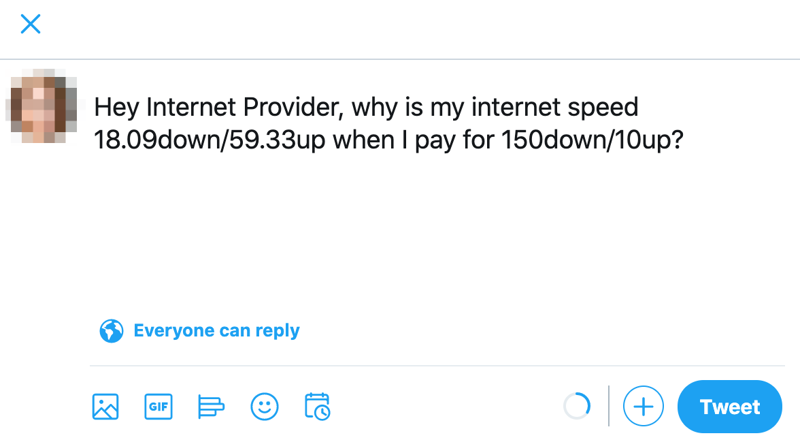

# Internet Speed Complainer

This Python script checks your internet speed using Speedtest.net. If the actual speed falls below the promised speed by your ISP, it automatically complains about it on Twitter.



## Installation

### 1. Install Python

Make sure you have Python 3 installed. If not, you can download it from [python.org](https://www.python.org/downloads/).

### 2. Clone the repository:

```bash
git clone https://github.com/RedeemedSpoon/Internet-Speed-Complainer.git
cd Internet-Speed-Complainer
```

### 3. Run the setup script:

```bash
python3 setup.py
```

Follow the instructions to set up important constants such as Twitter password and the path to the browser executable.

## Dependencies

- Python 3
- [Selenium WebDriver](https://www.selenium.dev/)
- [Beautiful Soup](https://www.crummy.com/software/BeautifulSoup/)

## Features

- Automated internet speed testing using Speedtest.net.
- Twitter complaints triggered when actual speed is below the promised speed.

## Limits

- Relies on the Speedtest.net website for accurate speed testing.
- Requires a Twitter account for automated complaints.
- Browser automation might be affected by website changes.

## How to Use

### Manual Execution

Run the script manually:

```bash
python3 speed_test.py
```

### Automate with Cron (Unix)

1. Open the crontab configuration:

```bash
crontab -e
```

2. Add the following line to run the script daily:

```bash
0 0 * * * /path/to/python3 /path/to/speed_test.py
```

Replace `/path/to/python3` and `/path/to/speed_test.py` with the correct paths.
(`/path/to/python3` -- python3 usually does the work and `/path/to/speed_test.py` is usually ~/Internet-Speed-Complainer)

### Automate with Task Scheduler (Windows)

1. Open Task Scheduler.

2. Create a new task.

3. In the "Actions" tab, create a new action to start a program:

- Program/script: `C:\Path\To\Python\python.exe`
- Add arguments: `C:\Path\To\internet_speed_complainer.py`

Replace `C:\Path\To\Python\python.exe` and `C:\Path\To\internet_speed_complainer.py` with the correct paths.

4. Set the trigger to daily.

## License

This project is licensed under the [MIT License](LICENSE).
